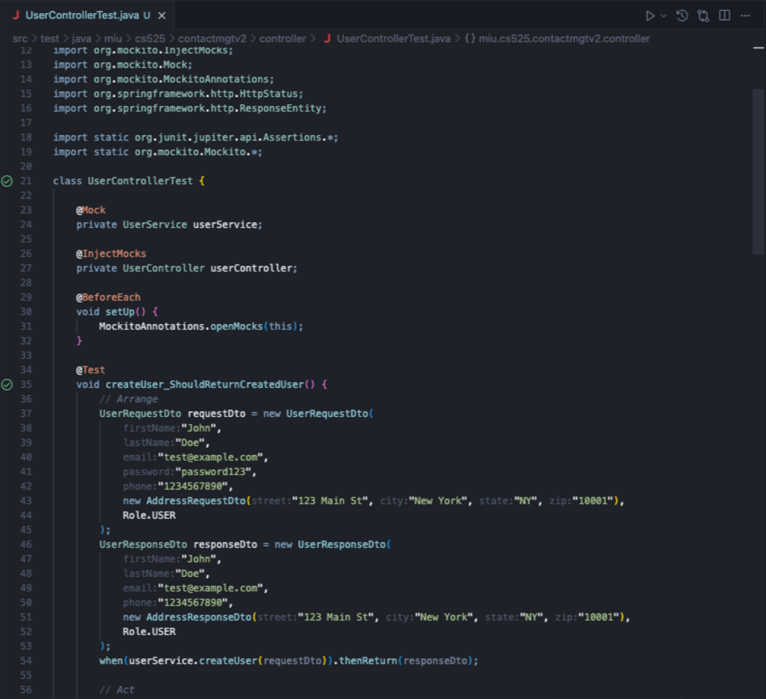

# Contact Management Application

As a User, 
- I want to register to the system as User role
- I want to login to the system
- I want to add a new contact 
- I want to view a contact details 
- I want to update a contact 
- I want to delete a contact 
-I want to update my user information 
- I want to view my contact list:
  - I can view all my contacts with pagination 
  - I can sort my contact list 
  
As an Admin,
- I want to login to the system as Admin role
- I want to view a list of all Users in the system
- I want to create a new user
- I want to view user information 
- I want to update a user information 
- I want to delete a user 

## Entity Relationship Diagram
- User: userId, firstName, lastName, email, password phone, address
- Role: roleId, name (USER, ADMIN)
- Contact: contactId, contactName, phone, email, address, note, tag
- Address: addressId, street, city, state, zip

## Domain Model Diagram

### 1. User Management      
* Register new users
* Login (JWT-based)
* User roles (USER, ADMIN)
### 2. Contact Management
* Create user

* View user list (with pagination)

* View user details

* Update user

* Delete user

After deleting userId 4

* Create contact

* View contact list (with pagination)

* View contact details

* Update contact

* Delete contact

Contact table data after deleting contactId 6

### 3.	Exception Handling
* Custom exception handling

### 4. Security
* Spring Security - Basic Authentication

* JWT-based authentication

### 5. Deploy to Cloud
* Deploy MySql database to Azure

* Deploy Spring Boot web application to Azure

#### Security after deploying to Azure

### 6. Unit Testing
* Controller

* Service

* Repository

### 7. Docker

